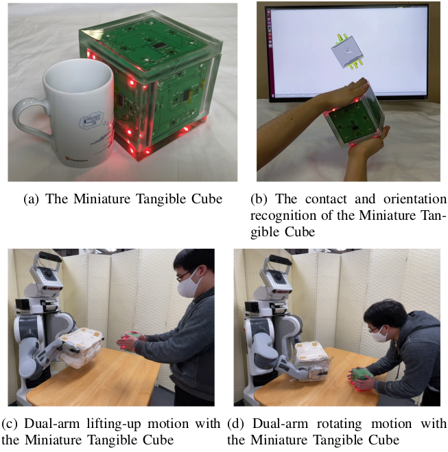

# rmui

[](https://github.com/knorth55/rmui/actions/workflows/main.yml)
[](https://github.com/knorth55/rmui/actions/workflows/linter.yaml)

Robot Manipulation User Interface (RMUI)



## Information

This package is the source code of the following paper:

- [Miniature Tangible Cube: Concept and Design of Target-Object-Oriented User Interface for Dual-Arm Telemanipulation](https://ieeexplore.ieee.org/abstract/document/9483662)

## Dependency

- [RoboticMaterials/FA-I-Sensor](https://github.com/RoboticMaterials/FA-I-sensor/)

## Installation & Build

### Normal Workspace build

```bash
mkdir rmui_ws/src -p
cd rmui_ws/src
wget https://raw.githubusercontent.com/knorth55/rmui/master/fc.rosinstall -o .rosinstall
wstool update -j 2
rosdep install --ignore-src --from-path . -y -r -c
cd ..
catkin build
```

### Device workspace build

```bash
ssh <your device>
mkdir rmui_ws/src
# for device
wget https://raw.githubusercontent.com/knorth55/rmui/master/device.rosinstall.${ROS_DISTRO} -o .rosinstall
wstool update -j 2
rosdep install --ignore-src --from-path . -y -r -c
cd ..
catkin build
```

### Baxter workspace build

```bash
cd rmui_ws/src
wstool merge knorth55/rmui/baxter.rosinstall
wstool update -j 2
rosdep install --ignore-src --from-path . -y -r -c
cd ..
catkin build
```

## Demo launch

### PR2 + RMUI

```bash
roslaunch rmui_demos pr2_rmui.launch
```

### PR2 + dummy RMUI

```bash
roslaunch rmui_demos pr2_rmui_dummy.launch
```

### Baxter + RMUI

```bash
# for real robot
roslaunch eus_vive baxter_moveit_remote.launch
```

```bash
roslaunch rmui_demos baxter_rmui.launch
```

### Baxter + dummy RMUI

```bash
# for real robot
roslaunch eus_vive baxter_moveit_remote.launch
```

```bash
roslaunch rmui_demos baxter_rmui_dummy.launch
```

## Device setup

### SD card backup

Please follow [here](https://www.pragmaticlinux.com/2020/12/how-to-clone-your-raspberry-pi-sd-card-in-linux/)

```bash
cd ~/Downloads
sudo dd bs=4M if=/dev/sde of=20211102_mtc2_melodic.img
sudo chown $USER: 20211102_mtc2_melodic.img

wget https://raw.githubusercontent.com/Drewsif/PiShrink/master/pishrink.sh
chmod +x pishrink.sh
LANG=en_US.UTF-8 sudo ./pishrink.sh 20211102_mtc2_melodic.img 20211102_mtc2_melodic_shrinked.img
tar czf 20211102_mtc2_melodic.img.tar.gz 20211102_mtc2_melodic.img
```

### SD card restore

Download [img file](https://drive.google.com/file/d/1eyhFw4hnbocyGisy8QOxdZNZSb30SXRO/view?usp=sharing).

```bash
tar xzf 20211102_mtc2_melodic.img.tar.gz
sudo dd bs=4M if=20211102_mtc2_melodic_shrinked.img of=/dev/sde
```

### Install LED setup

```bash
sudo pip install rpi_ws281x
```

### LED setup

Follow [jgarff/rpi_ws281x#spi](https://github.com/jgarff/rpi_ws281x#spi)

### additional LED setup for melodic

For melodic, please do the following, too.

```bash
sudo apt install sysfsutils
sudo echo devices/system/cpu/cpu0/cpufreq/scaling_min_freq = 1000000 > /etc/sysfs.d/99-cpu-min.conf
```

## RMUI device

### Miniature Tangible Cube

```bash
rosrun rmui_drivers rmui_node.py
```

#### Output

- `~output/proximities`: (`force_proximity_ros/ProximityArray`)

- `~output/imu`: (`sensor_msgs/Imu`)

## Sensors

### VCNL4040: Proxmity sensor

```bash
rosrun rmui_drivers vcnl4040_node.py
```

#### Output

- `~output`: (`force_proximity_ros/ProximityStamped`)

### BNO055: IMU

```bash
rosrun rmui_drivers bno055_node.py
```

#### Output

- `~output`: (`sensor_msgs/Imu`)

### Multiple VCNL4040 + PCA9547: Proxmity sensors

```bash
rosrun rmui_drivers vcnl4040_multiplexa_node.py
```

#### Output

- `~output`: (`force_proximity_ros/ProximityArray`)

## Actuators

### WX281x & OSTW3535C1A

```bash
rosrun rmui_drivers wx281x_node.py
```

#### Input

- ``~input``: (`rmui_msgs/LED`)

## Citation

```tex
@ARTICLE{9483662,
  author={Kitagawa, Shingo and Hasegawa, Shun and Yamaguchi, Naoya and Okada, Kei and Inaba, Masayuki},
  journal={IEEE Robotics and Automation Letters},
  title={Miniature Tangible Cube: Concept and Design of Target-Object-Oriented User Interface for Dual-Arm Telemanipulation},
  year={2021},
  volume={6},
  number={4},
  pages={6977-6984},
  doi={10.1109/LRA.2021.3096475}
}
```
